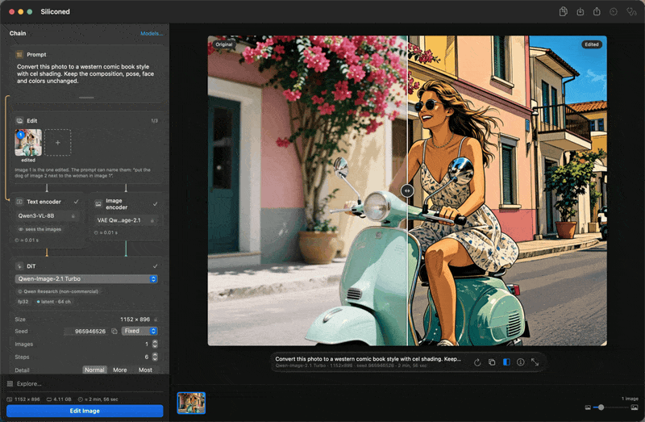
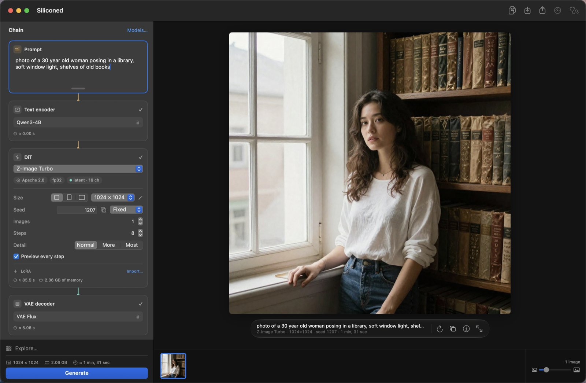
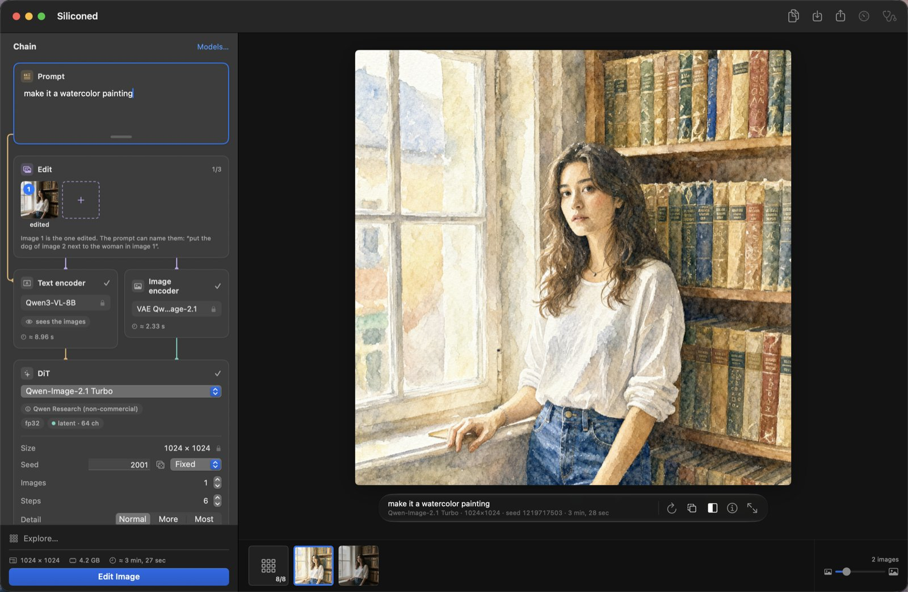
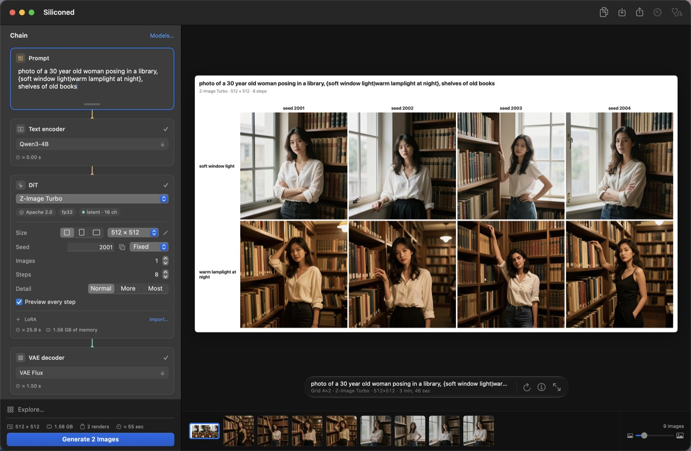
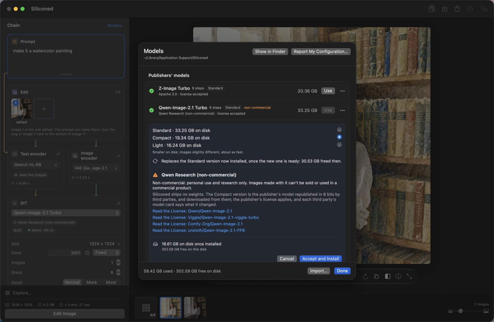

English · [Français](README.fr.md)

# Siliconed

*Siliconed — enhanced by silicone.*

**Image generation for Apple silicon that does the full computation, proves it, and never swaps.**

Siliconed is a free, open-source macOS app for **local text-to-image generation and AI image
editing** on Apple silicon Macs (M1 and later). It runs recent diffusion models —
[Z-Image Turbo](https://huggingface.co/Tongyi-MAI/Z-Image-Turbo) and
[Qwen-Image-2.1](https://huggingface.co/Qwen/Qwen-Image-2.1) — natively in Swift and Metal: no
Python, no server, no cloud, nothing leaves your Mac. It works offline once a model is installed.




*A photo from Z-Image Turbo, edited by Qwen-Image-2.1 with one sentence (“Convert this photo to a western
comic book style with cel shading”), compared under the curtain, filmed at real speed in the app.*

## Why Siliconed

- **Checked against the original models.** Every stage (text encoder, denoiser, VAE) is compared,
  channel by channel, with the reference implementation (diffusers / transformers in fp32 on CPU).
  Deviation at 1024²: 1.2·10⁻⁵ for Z-Image. What cannot be checked against the reference does not
  ship.
- **Full fp32, still fast.** Z-Image Turbo at 1024² in ~82 s on an M1 Pro, where Draw Things takes
  144 to 163 s with 8-bit weights on the same machine.
- **33 GB of model on a 16 GB Mac, zero swap.** Weights are read from disk as they are needed.
  The peak memory and the swap are measured at the worst case (1024×1536, three reference images),
  and both models fit with 0 bytes swapped.
- **Built to be driven by an AI.** `silicontrol` drives the running app from a terminal, with JSON
  output; `silicontrol help` is all an agent needs to read.
- **Your models, your way.** Import LoRAs and fine-tunes from Civitai or Hugging Face, install
  full-size, in 8 bits or in 4 to 6 bits, and see each license and the disk space before the first
  byte is downloaded.
- **Explore before you commit.** A grid of quick sketches across seeds, steps, LoRA strengths,
  models or prompt variants; the cell you pick becomes the finished image.
- **Reproducible to the bit.** Same prompt, seed and settings, same image, byte for byte: the edit
  above, redone in another session, came out identical.

## Models

Only recent models whose text encoder is a language model — no Stable Diffusion, SDXL or Flux.1.

| Model | Publisher | What it does | License |
|---|---|---|---|
| [Z-Image Turbo](https://huggingface.co/Tongyi-MAI/Z-Image-Turbo) | Tongyi-MAI | text-to-image, image-to-image, LoRA | Apache 2.0 |
| [Qwen-Image-2.1](https://huggingface.co/Qwen/Qwen-Image-2.1), with the [Viggle turbo LoRA](https://huggingface.co/Viggle/Qwen-Image-2.1-viggle-turbo) | Qwen | text-to-image, editing by instruction with 1 to 3 images, LoRA | Qwen Research (non-commercial) |

The Compact versions use 8-bit weights published by third parties:
[unsloth/Z-Image-Turbo-GGUF](https://huggingface.co/unsloth/Z-Image-Turbo-GGUF),
[Disty0/Z-Image-Turbo-SDNQ-int8](https://huggingface.co/Disty0/Z-Image-Turbo-SDNQ-int8),
[unsloth/Qwen-Image-2.1-FP8](https://huggingface.co/unsloth/Qwen-Image-2.1-FP8),
[Comfy-Org/Qwen-Image-2.1](https://huggingface.co/Comfy-Org/Qwen-Image-2.1); the Light versions, the
GGUF Q4_K_M of [unsloth/Z-Image-Turbo-GGUF](https://huggingface.co/unsloth/Z-Image-Turbo-GGUF) and
[unsloth/Qwen-Image-2.1-GGUF](https://huggingface.co/unsloth/Qwen-Image-2.1-GGUF) with the Compact's
text encoder. Every file is pinned to a
revision and checked by sha256 (`Sources/Siliconed/Forge/Installation.swift`).

## The app

`Siliconed.app` generates images from a prompt, edits them by instruction, and keeps a queue and a
history. It follows the system language (English, French, German, Spanish or Italian).

### Create

- **Two models.** Z-Image Turbo (Apache 2.0) and Qwen-Image-2.1 Turbo (Qwen Research license,
  non-commercial). Both read the prompt with a language model.
- **The chain, visible.** The rack shows the pipeline top to bottom (prompt, encoders, denoiser,
  decoder), with typed wires and the active stage lit; each stage holds its own settings.
- **More detail**: « Detail: Normal · More · Most » adds fine texture, at no extra time.
- **Variations**: cousins of an image, subtle or strong, with the same settings.
- **LoRAs**, and **image-to-image** with Z-Image.



### Edit

- **Editing by instruction** with Qwen-Image-2.1: give it 1 to 3 images and a sentence (“replace the
  cloudy sky with a blue sky”); its encoder sees the images. In the app an edit is capped at a
  surface of 1024².
- **Curtain**: drag a line across two images, or across an edit and its original, to see what
  changed.
- **A history like Photos**: arrows, ⌫ and ⌘Z, multiple selection, side-by-side comparison, export,
  drag and drop, Share.



### Explore

The exploration panel builds a grid in the canvas. Its axes: seeds, steps, the strength of a LoRA,
LoRAs to try, models, the alternatives written in braces in the prompt, or each image of an edit.
Each cell is a sketch, stopped after a few steps, at 512 on the short side (with Qwen-Image-2.1, a
finished image); once a model has rendered at that size, the panel shows what the grid will cost on
this Mac before you start. « Finish This Image » renders the
chosen cell to the end with the same seed: the image its sketch announced.



### Model management

- **Nothing is preinstalled.** You pick a model; before the first byte is downloaded the app shows
  its license and the disk space it takes, and asks you to accept. Every file is pinned to a
  revision and checked by sha256.
- **Standard, Compact or Light.** Z-Image and Qwen-Image-2.1 install with the publisher's weights
  (Standard, the default), with 8-bit weights published by third parties for the transformer and
  the text encoder (Compact: 11.7 GB instead of 20.4 for Z-Image, 19.4 GB instead of 33.2 for
  Qwen-Image-2.1, an image slightly different, about as fast), or with the transformer in 4 to 6 bits
  as a third party publishes it (GGUF Q4_K_M) and the Compact's text encoder (Light: 9.5 GB and
  16.2 GB, the least read from disk at each step; another set of weights, an image that may compose
  differently). The Light is preselected on a Mac with 8 GB of memory, the Standard elsewhere; you
  choose before installing. One version at a time:
  switching replaces the other, which keeps rendering until the new one is complete, then frees its
  space — if the disk cannot hold both, the app says so before you accept (`docs/API.md` §3.11).
- **Civitai and Hugging Face imports.** LoRAs (Civitai, Comfy, kohya, diffusers layouts) and a
  fine-tune's DiT (`.safetensors`, or `.gguf` from Q4 to Q8_0), by drag and drop. A quantized file
  stays as published on disk, never re-quantized (Z-Image: 6.2 GB in 8 bits, about 5 GB in GGUF
  Q4_K_M, instead of 12.3 GB; each step a little slower, the computation stays fp32); below 4 bits,
  the file is refused (`docs/API.md` §3.11).
- **Statistics and diagnostic.** The statistics palette (⌥⌘I) and « Report My Configuration » (a
  measured diagnostic, exported as JSON) are toolbar buttons.

Models live in `~/Library/Application Support/Siliconed` (override with `SILICONED_ROOT`).



### Private by construction

Rendering happens on your Mac. The only network traffic is the model download you accepted; the
diagnostic opens a prefilled GitHub issue that you choose to submit or not. Before each render the
engine checks the model, its license, the format and the memory it needs, and refuses up front
rather than letting the machine swap.

## Download

The app ships as a `.dmg` on the [Releases](https://github.com/gwenn-ha-dev/Siliconed/releases) page.
Requirements: macOS 15 or later, Apple silicon. The timings below were measured with 16 GB of memory.

## Numbers

Reference machine: MacBook Pro M1 Pro (8 cores, 14 GPU cores), 16 GB. 1024², seed 42.

| | Z-Image Turbo | Qwen-Image-2.1 Turbo |
|---|---|---|
| 1024², Standard | ~82 s (8 steps; 1024×1536 ~153 s) | ~134 s (6 steps); an edit with 1 image ~190 s, with 2 images ~263 s |
| 1024², Light (4 to 6 bits) | ~85 s | ~133 s; an edit with 1 image ~190 s |
| deviation from the fp32 reference (`model_out`) | 1.2·10⁻⁵ | 2.3·10⁻⁶ from the fp64 exact (512²) |

For comparison, Draw Things on the same machine, Z-Image `q8p`: 144 s for the first render, 163 s
for the fourth. Siliconed's ~82 s is in fp32; the comparison is about wall-clock time, not about
identical arithmetic. How the figures are measured: [Verification](#verification).

**Zero swap, measured.** Each model's peak `phys_footprint` and its swap-outs (`vm_stat` delta) are
measured at the product's worst case: Qwen-Image-2.1 at 1024×1536 with 3 references, 0 swap-out;
Z-Image at 1024×1536, 3.8 GB peak, 0 swap-out (its VAE decodes in bands, to the same bits).

Each side must be at least 512 and a multiple of 16, with a surface of at most 1024×1536. Below
512² the models are outside their domain.

## How it compares

- **[Draw Things](https://drawthings.ai)**, the reference native app on the Mac: measured on the same
  machine above. Siliconed is faster on Z-Image while computing in fp32, and is checked stage by stage
  against the reference implementation.
- **[ComfyUI](https://github.com/comfyanonymous/ComfyUI) or [diffusers](https://github.com/huggingface/diffusers)
  in Python**: the same models, without a Python environment or a node graph to wire. Siliconed
  implements them natively and checks itself against diffusers and
  [transformers](https://github.com/huggingface/transformers); `silicontrol` covers scripting and
  automation.

## Community diagnostic

One machine is not a benchmark. The app's **Report My Configuration** button runs a short
diagnostic (about 15 s per installed model, at 512²: the encoder, two denoiser evaluations, the
decoder), checks the denoiser output channel by channel against a small reference embedded in the
app, and opens a prefilled GitHub issue with the JSON report: chip, CPU and GPU cores, memory,
macOS, time per stage, estimated full render, peak memory, swap, bytes read from the disk, the memory
plan taken, the thermal state and power source before and after, the settings that differ from the
defaults, and a short matrix multiplication timed on the GPU and on the CPU. Nothing is sent unless
you submit the issue.

The reports fill this table, one line per chip:

| Chip | CPU cores | GPU cores | Memory | Z-Image Turbo 1024² | Qwen-Image-2.1 Turbo 1024² | Source |
|---|---|---|---|---|---|---|
| M1 Pro | 8 | 14 | 16 GB | ~82 s | ~134 s | reference machine |
| *your line here* | | | | | | [report](https://github.com/gwenn-ha-dev/Siliconed/issues/new?template=diagnostic.yml) |

## For AI agents and scripts: silicontrol

Drives the running app from a terminal. It ships in
`Siliconed.app/Contents/Helpers/silicontrol`; the app menu links it into `/usr/local/bin`. What you
add appears in the app's window, and there is one queue, never two renders at once.

```
silicontrol help                 the full reference (always start here)
silicontrol models
silicontrol add --wait --out out "a woman posing in a library"
silicontrol status
```

Output is JSON lines; the last one carries `"ok"`. How it works inside: `docs/REMOTE-CONTROL.md`.

## For developers

**The `Siliconed` library.** A Swift API for writing your own app on top of the engine:
`docs/API.md`. The app is its reference example, compiled with the package.

### Build from source

macOS 15 or later, Apple silicon, Xcode 26 or later (the app uses macOS 26 APIs where the system has them).

```
swift build                 the library, the app and silicontrol
swift test                  the pure unit tests, no weights needed
tools/app.sh                builds Siliconed.app at the repository root and opens it
tools/app.sh --no-open      builds only
tools/dmg.sh                packages the built app as .build/Siliconed-<version>.dmg
```

`swift test` needs nothing else: no weights, no Python.

By default the app is signed ad hoc: it runs on the Mac that built it. To distribute it, sign it
with your Developer ID:

```
tools/app.sh --sign "Developer ID Application: <name> (<team>)"
```

If `SILICONED_NOTARY_PROFILE` names a `notarytool` keychain profile, the app is also notarized and
stapled; `tools/dmg.sh` then signs and notarizes the disk image with the same identity.

### Verification

Each stage (text encoder, denoiser, VAE) is compared with the reference implementation, diffusers
and transformers in fp32 on CPU, on the same input. The deviation is measured channel by channel,
each channel against its own norm, so that a fault confined to one channel cannot hide in a global
figure. Where the fp32 reference carries its own rounding error, both are judged against an fp64
computation of the same stage, and the engine may be no further from it than the reference plus
25 %. Peak memory is read from `phys_footprint`, sampled during the render, swap from `vm_stat`, and
each timing is framed by a witness measurement before and after, since the machine drifts by several
percent from one render to the next. The oracle harness and the measurement journal are not part
of this repository; what ships is the pure unit tests and the small reference the diagnostic checks
against.

## Documentation

- `docs/API.md`: the `Siliconed` library API, for writing an app on top of it.
- `docs/REMOTE-CONTROL.md`: `silicontrol`, protocol and internals.
- `RELEASE-NOTES.md`: what changed in each version.
- Issues: [diagnostic report, bug, idea](https://github.com/gwenn-ha-dev/Siliconed/issues/new/choose).

## Credits

The models belong to their publishers (table above), each under its own license. The reference
implementations are [diffusers](https://github.com/huggingface/diffusers) and
[transformers](https://github.com/huggingface/transformers) by Hugging Face; the image resampling
reproduces [Pillow](https://github.com/python-pillow/Pillow)'s Lanczos to the bit. LoRAs and
fine-tunes come from the community, on [Civitai](https://civitai.com) and
[Hugging Face](https://huggingface.co).

## License

The code is under the [Apache License 2.0](LICENSE). The model weights are not part of this
repository: each is downloaded by you, under its own license, which the app shows before installing
it.
