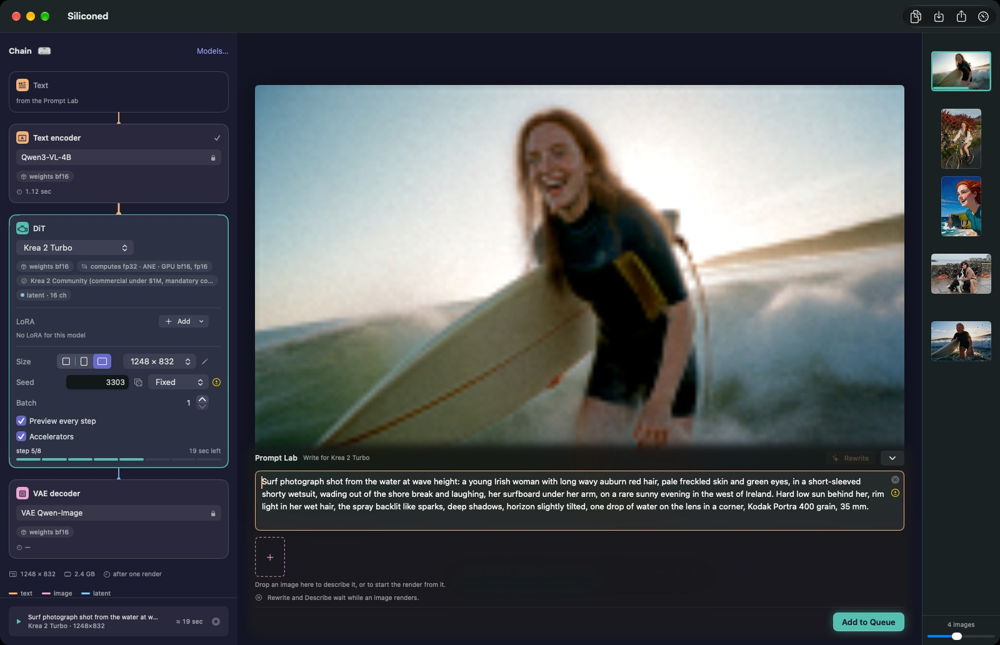
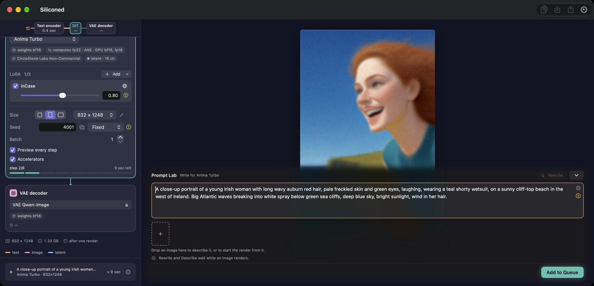
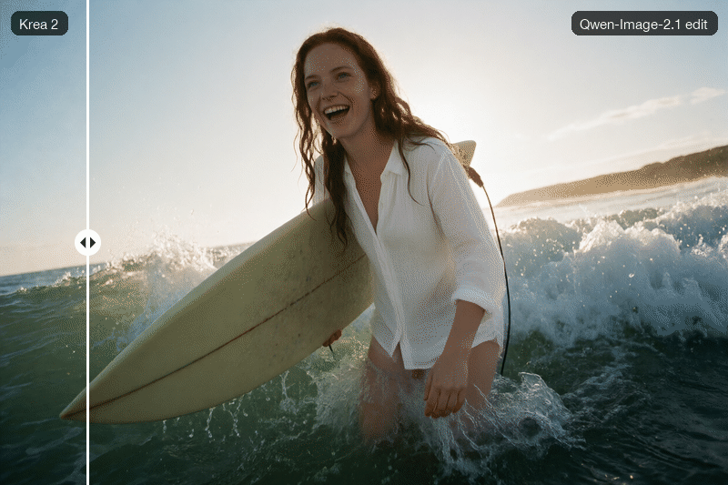
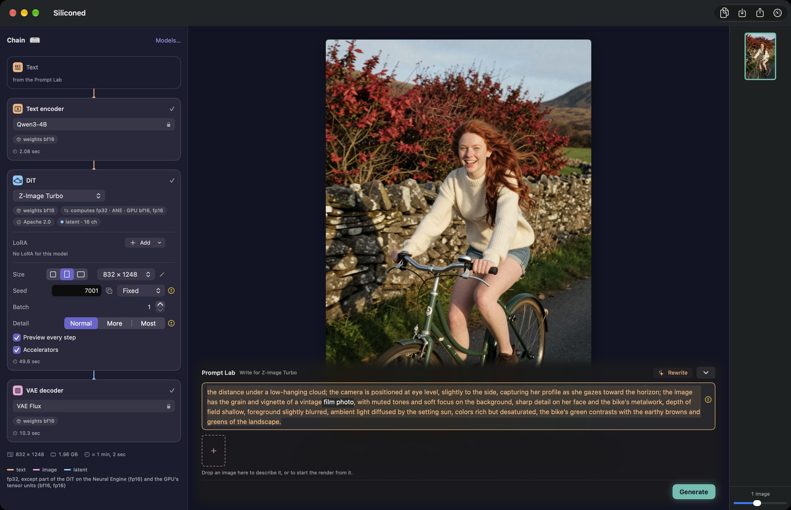
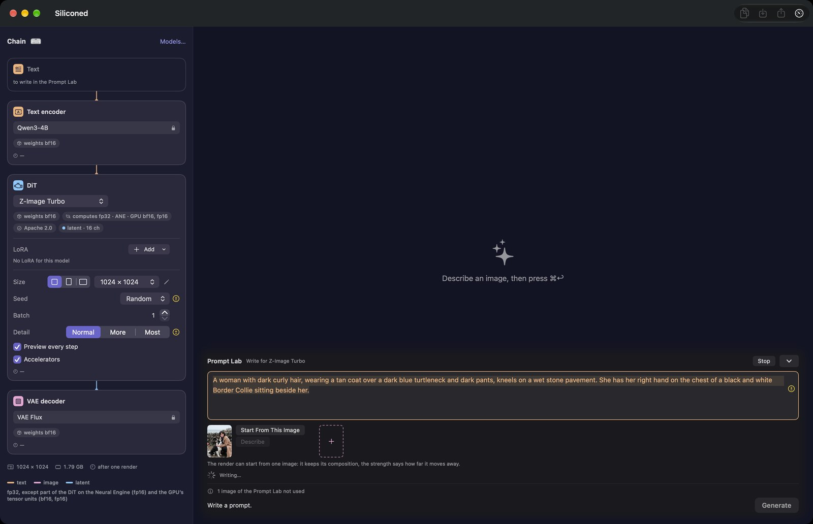
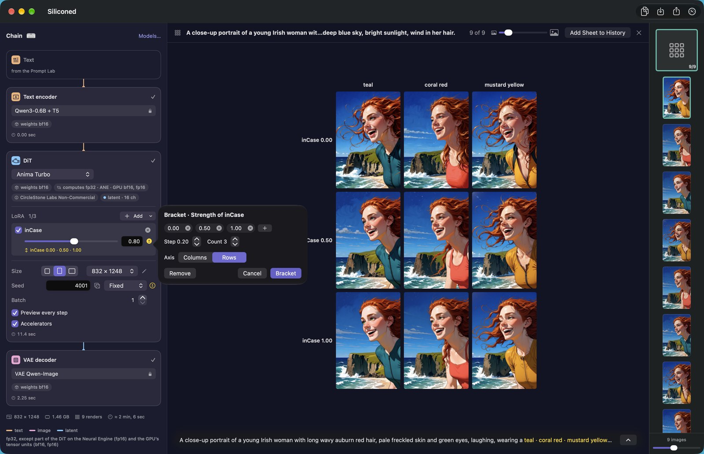
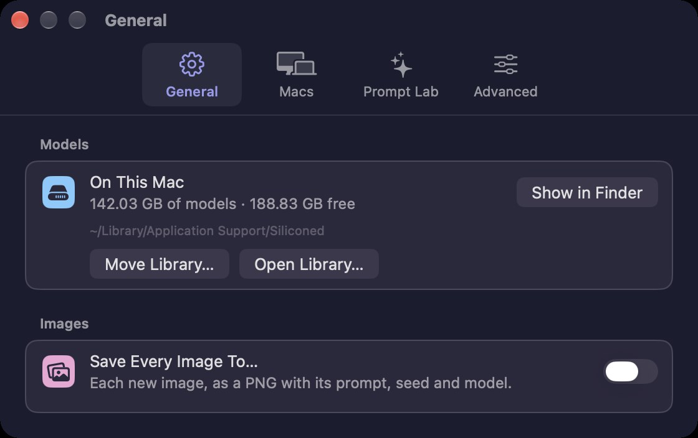
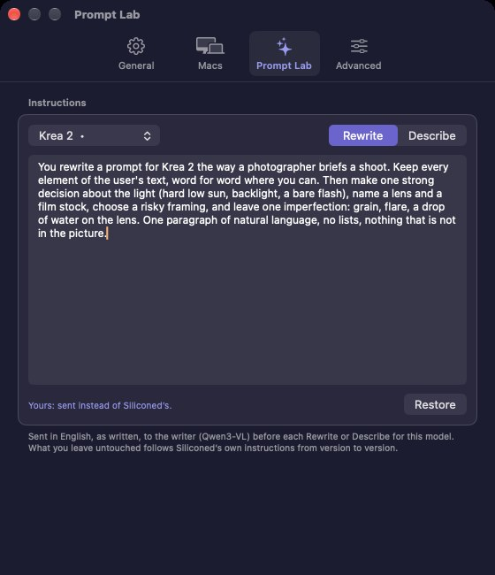

[English](APP.md) · Français

# L'app Siliconed

`Siliconed.app` transforme un prompt en image, retouche vos images quand vous lui dites quoi changer, et tient une file et un historique de tout ça. Pas de compte, pas de cloud, pas de roue qui tourne en attendant un serveur quelque part : juste votre Mac, qui travaille dur et vous dit ce qu'il fait. Elle suit la langue du système (anglais, français, allemand, espagnol, italien, japonais ou chinois simplifié).


*La fenêtre, avec la photo de Krea 2 Turbo de la section [Les modèles](#les-modèles) : le rack montre la chaîne, les réglages et le temps de chaque étage ; l'Atelier de prompts, replié, sous l'image ; l'historique à droite.*

Le moteur derrière elle, avec les mesures : [Le moteur de Siliconed](ENGINE.fr.md).

## Créer

- **Cinq modèles.** Krea 2 Turbo, Z-Image Turbo, Qwen-Image-2.1 Turbo, Anima Turbo et MOSS-Image, chacun sous sa propre licence ([Les modèles](#les-modèles)). Tous cinq lisent le prompt avec un modèle de langage.
- **La chaîne, visible.** Pas de tuyauterie cachée : le rack montre le pipeline de haut en bas (texte, encodeurs, débruiteur, décodeur), avec des fils typés et l'étage actif allumé ; chaque étage porte ses réglages et affiche son temps. Le texte et les images sont en tête, côte à côte, chacun au-dessus de l'encodeur qu'il nourrit : en lecture seule, en simple contour, ils s'écrivent et se choisissent dans l'Atelier de prompts, sous l'image. Chaque modèle rend en 8 pas, le nombre pour lequel il est distillé ; une ligne Pas ne paraît dans la boîte du débruiteur que si autre chose en a mis un autre (les réglages d'un PNG repris, `silicontrol add --steps`), avec une ✕ pour revenir à 8 ; avec l'option Bêta Choisir les pas allumée (Réglages › Avancé › Bêta), la ligne est toujours là, pour une LoRA distillée à moins de pas. Descendu jusqu'aux réglages du débruiteur, la chaîne reste en tête en petit, allumée de même, le temps de chaque étage dessous ; un clic ramène ses boîtes. Sous le titre, deux petites étiquettes disent ce qui est stocké et ce qui calcule : `poids int8` (ou `Q8_0`, `Q4_K_M`, `bf16`…, lu dans ce qui est installé) à côté de `calcule en fp32`. Sur le débruiteur, l'étiquette dit ce que font les accélérateurs de ce Mac : `calcule en fp32 · ANE` (une partie de ses produits sur le Neural Engine, en fp16), `calcule en fp32 · GPU bf16` (une partie sur les unités tensorielles du GPU, en bf16), les deux, ou un simple `calcule en fp32`. L'interrupteur **Accélérateurs** de la boîte du débruiteur les allume ou les éteint — éteint, le DiT est en fp32 de bout en bout —, et il est grisé, avec sa raison, sur un Mac dont la mesure ne leur donne rien à faire ([comment](ENGINE.fr.md#le-neural-engine)).
- **Plus de détail** avec Z-Image et Qwen-Image-2.1 : « Détail : Normal · Plus · Maximum » ajoute de la texture fine, sans temps en plus.
- **Rendu plus rapide** : dès 1024 px de chaque côté, les premières évaluations sur une grille en demi-taille, le reste en pleine taille. De 17 à 31 % de temps en moins sur la Compact en 1024² (7 % pour MOSS-Image ; un MacBook Pro M1 Pro, app 0.18), toujours 8 évaluations, une image un peu différente. C'est une option Bêta (Réglages › Avancé › Bêta), éteinte par défaut, qui ajoute un interrupteur à la boîte du débruiteur, à côté de celui des Accélérateurs : un choix par modèle, éteint pour toutes les versions tant que vous ne l'allumez pas, de sorte que les images restent celles vérifiées contre la référence. Option éteinte, aucun rendu n'est plus rapide ; vos choix reviennent quand vous la rallumez. L'interrupteur est grisé, avec sa raison, quand il ne ferait rien pour la taille réglée (un côté sous 1024 px), une LoRA, le Détail ou une édition. Le choix est enregistré avec l'image, donc Rendre à nouveau redonne la même ([comment](ENGINE.fr.md#rendu-plus-rapide)).
- **Les variations** : des cousines d'une image, subtiles ou marquées, aux mêmes réglages (le bouton sous l'image, ou son menu contextuel). **Rendre à nouveau (même graine)**, ⌘R, va dans l'autre sens : la même image, pour vérifier qu'on ne rêve pas. Une graine est celle de diffusers sur les cinq modèles (le même bruit de départ, au bit près). Le nombre d'images d'un coup, c'est le **Lot** du rack.
- **Agrandir ×4** avec la super-résolution de macOS (macOS 26) : aucun prompt, rien d'ajouté, bords et textures affinés ; 1024² devient 4096² en une ou deux secondes une fois le modèle de macOS chaud. Elle prend les images jusqu'à 1920 px de côté, et une image agrandie ne s'agrandit pas une seconde fois. L'original reste dans l'historique.
- **Les LoRA** sur les cinq modèles, dans la boîte du débruiteur : Ajouter liste les LoRA du modèle, puis Importer… pour un fichier de Civitai. Chacune est une carte : une case pour l'éteindre sans la perdre, sa force (un curseur, ou le chiffre tapé), et ses mots déclencheurs, quand son fichier les donne, en bouton qui les met en tête du prompt. Clic droit : Remplacer par, Revenir à 0,8, Retirer. Trois au plus.
- **Reproductible au bit près.** Même prompt, même graine, mêmes réglages, même version, sur le même Mac : la même image, octet pour octet. Deux choses peuvent changer les pixels : une nouvelle version de l'app (la 0.12 l'a fait, de quelques unités sur le dernier chiffre, quand son arithmétique s'est mise à arrondir comme la référence), et une nouvelle mesure de ce Mac, qui peut répartir le travail en d'autres lignes ([Mesurer ce Mac](#mesurer-ce-mac)).



*Un rendu en cours, Aperçu à chaque pas coché : l'étage actif est allumé, ses pas et le temps restant dessous ; l'image se forme sur place.*



*Défilé jusqu'aux réglages du débruiteur, la chaîne reste en tête, en petit, allumée de la même façon.*

Chaque côté doit être d'au moins 512 et multiple de 16 ; la surface n'a pas de plafond fixe : le budget mémoire décide. Ce qu'un format coûte se calcule sur les formes du modèle avant le premier calcul et se juge contre le budget mémoire du Mac ([comment](ENGINE.fr.md#la-mémoire-et-le-budget)) : un Mac qui ne peut pas le tenir le refuse, et dit lequel le peut. Le sélecteur de taille propose 1536² et 2048² à côté de 1024², et grise ce que le budget de ce Mac refuse ; toute autre taille se tape. Les formats au-delà de 1024×1536 sont chiffrés par les mêmes formules ; Anima Turbo en 2048² a été rendu sur un Mac de 16 Go, avec un pic de 5,4 Go. Sous 512² les modèles sont hors de leur domaine. Qwen-Image-2.1 veut des multiples de 32 (son VAE divise par 16), et Anima au plus 2048 px de côté (les positions que sa référence calcule) ; l'un et l'autre sont refusés avant tout calcul, de même que tout côté au-delà de 8192 px.

**Format en deux échelles** (Réglages › Avancé › Bêta, éteint par défaut) sépare en deux le menu Format du rack : une proportion (1:1, 4:5, 3:4, 2:3, 9:16 et, couchés, 5:4, 4:3, 3:2, 16:9), puis une résolution, 1K (environ 1 mégapixel) ou 2K (environ 4) ; l'app calcule les pixels, toujours multiples de 32 pour que tous les modèles les prennent. Le crayon, le contrôle de mémoire et les limites de chaque modèle ne changent pas, et le menu par défaut reste le défaut.

| Proportion | 1K | 2K |
|---|---|---|
| 1:1 | 1024 × 1024 | 2048 × 2048 |
| 4:5 | 896 × 1120 | 1792 × 2240 |
| 3:4 | 864 × 1152 | 1728 × 2304 |
| 2:3 | 832 × 1248 | 1664 × 2496 |
| 9:16 | 768 × 1344 ≈ | 1440 × 2560 |

Les paysages sont les mêmes tailles couchées (le 3:2 fait 1248 × 832 en 1K). Le ≈ : en 1K, un 9:16 exact est hors d'atteinte : un 9:16 exact en multiples de 32 ne va que par pas de 288 × 512 (576 × 1024, 864 × 1536), donc la 1K garde 768 × 1344, qui est en réalité un 4:7 (1,6 % d'écart) et s'affiche « ≈ 9:16 » ; pareil pour le 16:9 couché. En 2K, 1440 × 2560 est un 9:16 exact. Anima s'arrête à 2048 px de côté : sa 2K est le carré seul, et les autres tailles 2K sont grisées avec cette raison. `silicontrol add` et `grid` prennent les mêmes tailles écrites `3:4@2K`, option Bêta allumée ou non ([Télécommande](REMOTE-CONTROL.fr.md)).

## Éditer

- **L'édition par instruction** avec Qwen-Image-2.1 Turbo : donnez-lui 1 à 3 images et une phrase (« remplace le ciel nuageux par un ciel bleu ») ; son encodeur voit les images. Dans l'app, une édition est plafonnée à une surface de 1024².
- **Trois façons de comparer** deux images, ou une édition ou un agrandissement et son original : Rideau, Alterner ou Côte à côte, à choisir dans la barre d'outils du canevas.
  - **Rideau** : faites glisser une ligne sur les images pour voir ce qui a changé. Zoomez vers le curseur pour regarder un détail : en pinçant, ou à la molette d'une souris (une molette horizontale déplace toujours l'image).
  - **Alterner** : les deux mêmes images, une à la fois, au même endroit et au même zoom ; cliquez sur l'image, ou appuyez sur ← pour la première et → pour la seconde.
- **Les sujets nommés** : nommez une personne, un objet ou un style à partir d'une photo, puis citez-le par `@nom` dans le texte de l'Atelier de prompts (voir Préparer, plus bas) ; le rendu reçoit le prompt traduit et les images numérotées.
- **Un historique comme dans Photos**, en colonne à droite (le curseur à son pied règle la taille des vignettes) : flèches, ⌫, le ✕ d'une vignette survolée et ⌘Z, sélection multiple, export, glisser-déposer, Partager. Depuis un terminal : `silicontrol remove`, `undo`, `crop`, `again`, `reuse`, `save` (PNG, JPEG, HEIC).


*Qwen-Image-2.1 Turbo, Standard : « Convert this photo to a western comic book style with cel shading », la photo Krea 2 en image 1, 1248×832, graine 42.*



*Une édition qui ne change que ce qu'on lui dit : « Replace her wetsuit with a white linen blouse. Keep her face, hair, surfboard, pose and the beach unchanged. », la photo Krea 2 en image 1, graine 42.*


*Des sujets : un manteau camel, un border collie et une femme, nommés dans une seule photo (un rendu de Z-Image Turbo sur un quai de Bretagne), puis cités par leur nom. Qwen-Image-2.1 Turbo, Standard, la surfeuse en image 1, graine 42.*


*Les mêmes sujets sans image à éditer : une image neuve, 832×1248, graine 42.*

## Préparer (et laissez un modèle taper)

L'**Atelier de prompts** est la barre sous l'image, où se préparent le texte et les images du prochain rendu. Replié, c'est une ligne à lire : les images qui partent, en petites vignettes, le texte, et combien d'images le rendu ne lira pas ; rien n'y lance un rendu ni une réécriture, si bien qu'un clic pour reprendre le texte ne fait que le déplier. **Générer**, c'est ⌘↩ de partout dans la fenêtre ; quand quelque chose l'empêche, ⌘↩ déplie la barre, là où la raison est dite. La fenêtre s'ouvre sur lui déplié (replié tant qu'aucun modèle n'est installé, les modèles à télécharger en vue) ; un clic sur le texte, ou ⌥⌘L (Présentation › Afficher l'Atelier de prompts), le déplie en plaque de verre par-dessus l'image, aux bords qui s'estompent, l'image gardant sa taille ; un clic sur l'image, ou Échap, le replie, le texte gardé. Le bouton à côté de son chevron détache la plaque dépliée dans une fenêtre à elle, redimensionnable, son texte grandissant avec elle ; fermer cette fenêtre replie l'atelier sur sa ligne. Son pied porte ce qui varie et Générer ; ce qui empêche Générer s'y dit, avec la plus grande taille que ce Mac rend quand la mémoire manque. Ce que coûte le rendu (taille, mémoire, temps) est à la chaîne, sous elle dans le rack. La file d'attente, la mesure de ce Mac et ce qui a échoué restent sous le rack. Son texte est le prompt du rack et ses images sont les entrées du rack : rien à recopier ni à porter, et le rack montre ce qui partira.

- **Images** : déposez-les sur la barre ou sur le canevas, collez-en une (⌘V), ouvrez-les (+), ou envoyez-en une depuis l'historique (son menu : Envoyer à l'atelier, ou Éditer avec Qwen-Image-2.1, qui l'envoie comme image à éditer). Chaque image a un rôle, dans son menu. Avec Qwen-Image-2.1, une image prend la place suivante : la première est l'**Image à éditer** (l'image 1, qui donne le format), les suivantes des **Références**, trois images au plus avec les sujets que cite le texte ; au complet, une arrivante entre **Sans rôle** et le dit. Avec Z-Image, Anima, Krea 2 et MOSS-Image, une image arrive sans rôle, avec deux boutons : **Décrire**, et **Partir de cette image** (img2img). Le rendu part alors d'elle au lieu du bruit et garde sa composition, et sa **force** (de 0 à 100 % ; pour commencer 65 % sur Krea 2, 75 % sur Z-Image et Anima, 80 % sur MOSS-Image), réglée sur sa vignette et lue au rack, dit jusqu'où il s'en éloigne ; la taille prend le format le plus proche de ses proportions (un autre reste à vous : le centre est gardé). Le PNG écrit la force, pas l'image.
- **Changer de modèle ne donne jamais de rôle et n'en change aucun en un autre** : une référence garde son rôle sous Z-Image, sans effet (sa vignette le dit), et resert de retour sous Qwen-Image-2.1 ; l'image que Qwen édite ne devient jamais le départ d'un img2img. À côté de Générer, « 1 image de l'atelier non utilisée » compte ce que le prochain rendu ne lira pas. Clic droit sur une image : Recadrer…, Remplacer…, Nommer…, Reprendre ces réglages (pour un PNG écrit par Siliconed : en déposer un ne change plus le rack de lui-même), Retirer.
- **Sujets** : Nommer… donne à une image un nom, un genre et un cadre, et le texte la cite par `@nom` (complété à la frappe). Un sujet ne part au rendu que si le texte le cite, après les images que les rôles envoient, dans l'ordre où le texte les nomme. Le texte garde ses `@noms` : ils sont traduits en « image N » à la mise en file, et le PNG garde les deux. Les sujets vivent en mémoire seulement (rien n'est écrit sur le disque, comme l'historique). `silicontrol subjects` agit sur les mêmes.
- **Ce qui est grisé ne part pas.** Sous un modèle qui ne lit pas d'image, le `@nom` d'un sujet est grisé et laissé hors de ce que lit le modèle (tout autre `@` reste du texte : les artistes d'Anima) ; de même un renvoi à une image que le rendu n'emporte pas (`<image3>`, `image 3` ou `Picture 3` avec deux images). Le survol dit pourquoi ; le texte les garde pour un modèle qui les lit.
- **Texte** : un seul texte, toujours modifiable à la main ; la ✕ dans son coin l'efface (⌘Z le ramène). **Réécrire** en fait un texte écrit pour le modèle du rack, nommé dans le titre de la barre, et garde vos `@noms` (un nom perdu est signalé, jamais retiré en silence) ; les ajouts et les retraits sont marqués, et un clic dans le texte range les marques. **Décrire**, sur une image, écrit dans le texte ce qu'elle montre : il remplit un texte vide, sinon il s'insère au curseur ou remplace la sélection (à la fin quand le texte n'est pas à l'écran). L'un et l'autre écrivent dans le texte au fil du rédacteur. ⌘Z annule tout geste du modèle. Un `@nom` ne peut pas se trouver dans un groupe `{a|b}`. `silicontrol rewrite` et `silicontrol describe` sont ces deux mêmes gestes pour un terminal (même rédacteur, mêmes consignes, même protection des `@noms`, mêmes attentes) ; le texte revient par la socket ; `silicontrol lab rewrite` et `lab describe N` l'écrivent dans le texte de la barre, marques comprises, comme les boutons. `silicontrol lab` lit et change la barre : ses images, leurs rôles, repliée ou non.
- **En suivant un autre Mac** (voir plus bas) : Réécrire et Décrire sont éteints et le disent ; les images, les rôles et les sujets remplissent le rack que vous voyez, qui envoie ses références au Mac qui rend.
- **Réécrire et Décrire sont les seuls gestes qui ont besoin du rédacteur** (plus bas) : pendant un rendu, ou sans rédacteur, eux seuls attendent, et le reste de la barre marche.
- **Le rédacteur est un modèle que vous avez déjà** : l'encodeur de texte de Qwen-Image-2.1, Qwen3-VL-8B, mis à écrire. Il ne manque au modèle installé que sa couche de sortie, et « Installer le rédacteur » (ou `silicontrol install writer`) la télécharge dans le même dépôt (1,25 Go, par plage d'octets ; pas de licence propre, c'est celle de Qwen-Image-2.1). Il faut Qwen-Image-2.1 installé, et il lit ses couches selon un plan choisi dans le budget de mémoire avant le premier mot : sur un Mac de 16 Go, toutes celles de la Compact en mémoire ; sur un Mac de 8 Go, ou avec la Standard sur 16 Go, une partie depuis le disque à chaque jeton, plus lentement. La fenêtre dit ce qui manque.
- **Nos consignes, une par modèle**, tirées de ce que chaque éditeur dit de ses prompts. Chaque élément de votre prompt est gardé, le texte entre guillemets mot pour mot ; rien n'est retiré, adouci ni moralisé.
- **Jamais pendant un rendu** : une image qui démarre arrête le rédacteur, et Réécrire et Décrire attendent. Sur un M1 Pro avec la Compact, le premier mot vient après environ 10 s pour Réécrire et 25 s pour Décrire, qui lit d'abord l'image, puis environ 12 jetons par seconde, sur le GPU. Sa sortie gloutonne est celle de transformers, jeton pour jeton ([VERIFY](VERIFY.fr.md)).
- **Incognito** : textes, images et sujets restent en mémoire, sans fichier ni historique ; le rédacteur rend ses poids après chaque geste, si bien que la mémoire du Mac est libre entre deux.


*L'Atelier de prompts déplié sur l'image, en apparence claire : Z-Image Turbo, Standard, 832×1248, graine 7001.*



*Réécrire : une idée d'une ligne écrite pour Z-Image Turbo, ce qui a été ajouté marqué dans le texte.*



*Décrire : le rédacteur lit l'image et écrit ce qu'elle montre dans le texte, au fil de l'eau.*

## Séries (bracketez, puis choisissez)

Tout ce qui varie fait une série, et tout ce qui peut varier porte le même ± jaune à sa droite : vide il propose, plein il varie, ses valeurs écrites dessous avec la flèche de leur axe (↔ colonnes, ↕ lignes). Un groupe `{red|blue}` dans le prompt en est une, dessiné en pastille jaune avec un point entre ses mots : un clic dessus ouvre sa bulle, et le ± à droite du texte, sous sa ✕ — ou Varier ce mot… en tête du menu du clic droit — en fait un du mot sélectionné, ou de celui où est le curseur. Le Lot en est une autre : des graines consécutives à partir de celle du rack, son ± sur la ligne Graine. Les molettes font le reste, par leur ± ou clic droit › Bracketer… : la force d'une LoRA, des LoRA comparées (le ± du titre LoRA, ou Ajouter › Comparer des LoRA…, quand le modèle en a deux ou plus : une ajoutée par image, et l'image sans), la force de l'image de départ, le Détail et, avec Plus de solveurs allumé, le solveur. La bulle propose trois valeurs autour de celle de la molette (une LoRA ±0,2, l'image de départ ±15 points), un pas et un nombre pour les refaire, et l'axe qu'elles prennent, colonnes ou lignes ; placé où est déjà un axe, il le remplace, et dit lequel avant le clic. Une série, c'est deux valeurs ou plus. Deux axes au plus, le Lot compris : à côté de Générer, une ligne par axe avec sa ✕, et ⇄ pour les échanger ; une troisième chose qui varie éteint Générer et dit pourquoi. Générer met alors en file une image finie par case, celle-là même qu'il rendrait seule, dans l'historique une à une ; le canevas les dispose en grille pendant le rendu et jusqu'à ce que vous en choisissiez une, et Ajouter la planche à l'historique dessine la planche quand vous la voulez. Les modèles, les pas et chaque image d'une édition varient depuis un terminal : `silicontrol grid` (ses axes deviennent la série de la fenêtre là où la fenêtre les a) et `silicontrol sheet g2`.


*Une série avec Anima Turbo et la LoRA inCase : la couleur de la combinaison écrite en groupe dans le prompt (`{teal|coral red|mustard yellow}`) en colonnes, inCase bracketée à 0, 0,5 et 1 en lignes ; 832×1248, graine 4001, neuf images finies.*


*Ce qui varie, là où ça varie : le groupe dans le texte, le ± d'inCase dans le rack, une ligne par axe à côté de Générer.*



*La bulle d'un réglage : ses valeurs, un pas et un nombre pour les refaire, et l'axe qu'elles prennent.*

## La gestion des modèles

- **Rien n'est préinstallé.** Vous choisissez un modèle ; avant le premier octet téléchargé, l'app affiche sa licence et la place qu'il prend sur disque, et vous demande d'accepter. Chaque fichier est figé à une révision et vérifié par sha256.
- **Standard, Compact ou Légère.** Chaque modèle s'installe avec les poids de l'éditeur (Standard), avec des poids 8 bits publiés par des tiers (Compact, le défaut et celle que nous recommandons : 19,5 Go au lieu de 34,4 pour Krea 2, 11,7 Go au lieu de 20,4 pour Z-Image, 17,3 Go au lieu de 31,2 pour Qwen-Image-2.1, 4,10 Go au lieu de 5,65 pour Anima, 17,9 Go au lieu de 27,5 pour MOSS-Image ; une image légèrement différente), ou avec le transformeur en 4 à 8 bits, quantifié par Siliconed lui-même (SQ, publié sur Hugging Face ; Légère : 12,9 Go, 9,5 Go, 14,4 Go et 3,15 Go, le moins lu sur le disque à chaque pas ; un autre jeu de poids, une image qui peut se composer autrement). Pour Krea 2, Z-Image, Qwen-Image-2.1 et MOSS-Image, l'encodeur de texte de la Compact est lui aussi en 8 bits, et la Légère le reprend ; celui d'Anima reste le bf16 de l'éditeur dans les trois, faute de version 8 bits publiée. MOSS-Image n'a pas de Légère. La Légère est présélectionnée sur un Mac de 8 Go de mémoire, la Compact ailleurs ; vous choisissez avant d'installer. Une version à la fois : passer à l'autre la remplace ; l'installée continue de rendre jusqu'à ce que la nouvelle soit complète, puis libère sa place ; si le disque ne peut pas tenir les deux, l'app le dit avant l'acceptation.
- **Les imports Civitai et Hugging Face.** Les LoRA (formats Civitai, Comfy, kohya, diffusers) et le DiT d'un fine-tune (`.safetensors`, ou `.gguf` de Q4 à Q8_0), par glisser-déposer ou ⌘O ; un checkpoint Civitai d'une famille connue s'importe tel quel et emprunte l'encodeur et le VAE de sa famille. Déposé avant que sa famille soit installée, il ouvre l'installation de celle-ci — licence, encodeur et VAE, jamais le DiT de la famille — et s'importe une fois l'installation faite. Un fichier quantifié reste sur le disque tel que publié, jamais requantifié (Z-Image : 6,2 Go en 8 bits, environ 5 Go en GGUF Q4_K_M, au lieu de 12,3 Go ; chaque pas un peu plus lent, le calcul reste en fp32) ; sous 4 bits, le fichier est refusé. Une LoRA importée prend le nom de son fichier ; le nom donné par son auteur et ses mots déclencheurs s'affichent en infobulle.
- **Statistiques.** Une palette flottante (⌥⌘I, Fenêtre › Statistiques, ou le bouton de la barre d'outils) : où en est le rendu, ce que chaque étage a coûté, ce qui reste pour lui et pour la file, et ce que pesait le dernier rendu. Rien n'est estimé d'après une constante : un modèle ou un format jamais rendu ici n'a pas d'estimation, et la palette le dit.

### Mesurer ce Mac

Avant son premier rendu, puis après une mise à jour ou un nouveau macOS, Siliconed chronomètre ce que calcule chaque moteur de votre Mac. Le premier rendu la lance de lui-même et l'attend ; mieux vaut le Mac au repos — ni export, ni compilation, ni jeu pendant ce temps —, parce que ce qu'une autre app prend au GPU, au processeur ou au Neural Engine est compté comme manquant à votre Mac. Une minute environ, cinq au plus, aucun modèle, et toujours une carte : rien n'est jamais refusé, et la confiance qu'on peut avoir dans chaque chiffre est écrite à côté. Vous pouvez l'ouvrir quand vous voulez : Aide › Mesurer ce Mac…, le titre Chaîne et l'icône du Mac en tête du rack (grisée tant que ce Mac n'est pas mesuré), ou Réglages › Mac › Ce Mac. Elle n'est pas dans la fenêtre Modèles : installer un modèle et mesurer un Mac sont deux métiers différents.

La feuille montre, colonnes titrées : la vitesse de chaque route, sa part de la crête du GPU, si son résultat est égal au résultat exact (Exact ✓), ce que chaque moteur garde de sa vitesse quand ils travaillent ensemble, la mémoire que la mesure a tenue et sa durée. Ce qu'elle a trouvé est dit en phrases simples, chacune avec son effet sur le plan. Le partage est une option, jamais le bouton par défaut : Partager… ▸ Ouvrir un signalement GitHub, ou Copier le JSON.

Une mesure que vous demandez s'applique au **rendu suivant**, jamais à un rendu en cours : à partir de là, une même graine peut donner une image un peu différente de celle d'avant la mesure. Quand un rendu s'est écarté de plus de 10 % de ce que la mesure prévoyait, la barre latérale le dit, une fois, à côté du bouton qui mesure de nouveau.

Les modèles vivent dans `~/Library/Application Support/Siliconed` (modifiable avec `SILICONED_ROOT`). Pour libérer le disque interne, Réglages › Déplacer la bibliothèque… les déplace sur un autre — un disque externe, un partage réseau : chaque fichier est copié, vérifié, puis effacé du Mac. Siliconed ne copie alors sur le Mac que les modèles que vous rendez, le temps de la session, et les efface en quittant ; les licences acceptées et la mesure de ce Mac restent sur le Mac. Débranché, le disque est signalé : rien ne se rend avant son retour. Depuis un terminal : `silicontrol library move DOSSIER` (sans `--yes`, elle dit ce qui serait copié et la place qu'il y a).


## Les modèles

Seulement des modèles récents dont l'encodeur de texte est un modèle de langage — ni Stable Diffusion, ni SDXL, ni Flux.1.

| Modèle | Éditeur | Ce qu'il fait | Licence |
|---|---|---|---|
| [Krea 2 Turbo](https://huggingface.co/krea/Krea-2-Turbo) | Krea | texte vers image (des images esthétiques, de la photographie à la peinture), LoRA | Krea 2 Community : usage commercial sous 1 M$ de chiffre d'affaires annuel, un filtre de contenu obligatoire au déploiement |
| [Z-Image Turbo](https://huggingface.co/Tongyi-MAI/Z-Image-Turbo) | Tongyi-MAI | texte vers image, LoRA | Apache 2.0 |
| [Qwen-Image-2.1 Turbo](https://huggingface.co/Qwen/Qwen-Image-2.1-Turbo) | Qwen | texte vers image, édition par instruction avec 1 à 3 images, LoRA | Qwen Research (non commerciale) |
| [Anima Turbo v1.1](https://huggingface.co/circlestone-labs/Anima) | CircleStone Labs × Comfy Org | texte vers image (illustration, peinture, anime ; pas de photoréalisme, par choix de l'éditeur), LoRA | CircleStone Labs Non-Commercial ; ses images sont utilisables commercialement |
| [MOSS-Image](https://huggingface.co/OpenMOSS-Team/MOSS-Image-SFT) | OpenMOSS, sous la LoRA 8 pas de lodestones | texte vers image, LoRA ; bêta | Apache 2.0 |

### Krea 2 Turbo, le plus gros des cinq

[Krea 2 Turbo](https://huggingface.co/krea/Krea-2-Turbo), de Krea, est le quatrième modèle, arrivé dans la 0.12 : un DiT de 12,9 milliards de paramètres, le plus gros des cinq, pour des images esthétiques, de la photographie à la peinture. Il lit le prompt avec Qwen3-VL-4B et fait toute sa recette de 8 évaluations en fp32 sur les poids bf16 de l'éditeur, avec le [rendu plus rapide](ENGINE.fr.md#rendu-plus-rapide) en option Bêta (temps et écarts : [Les chiffres](ENGINE.fr.md#les-chiffres)), ses poids lus depuis le disque dans le budget mémoire. Il s'installe en Standard, Compact ou Légère (tailles : [La gestion des modèles](#la-gestion-des-modèles)), depuis des copies ouvertes prouvées identiques aux fichiers de Krea (voir plus bas), sous la licence Krea 2 Community (tableau ci-dessus).


*Krea 2 Turbo, Standard, 1248×832, 8 pas, graine 3303 : « Surf photograph shot from the water at wave height: a young Irish woman with long wavy auburn red hair, pale freckled skin and green eyes, in a short-sleeved shorty wetsuit, wading out of the shore break and laughing, her surfboard under her arm, on a rare sunny evening in the west of Ireland. Hard low sun behind her, rim light in her wet hair, the spray backlit like sparks, deep shadows, horizon slightly tilted, one drop of water on the lens in a corner, Kodak Portra 400 grain, 35 mm. »*

Krea 2 Turbo ne télécharge rien de [krea/Krea-2-Turbo](https://huggingface.co/krea/Krea-2-Turbo) : ce dépôt demande un compte Hugging Face, et l'app n'a pas de connexion. Chacun de ses fichiers vient d'une copie ouverte prouvée identique à celle de Krea : le DiT et l'encodeur de texte Qwen3-VL-4B en bf16 de [Comfy-Org/Krea-2](https://huggingface.co/Comfy-Org/Krea-2) (le DiT, le même fichier ; l'encodeur, égal tenseur pour tenseur), le VAE de [Qwen/Qwen-Image](https://huggingface.co/Qwen/Qwen-Image) (le VAE fp32 de Krea est ce bf16 élargi, valeur pour valeur), le tokenizer de [Qwen/Qwen-Image-2.1-Turbo](https://huggingface.co/Qwen/Qwen-Image-2.1-Turbo) (le même fichier) ; les fichiers de configuration de Krea sont embarqués tels que publiés. Sa Compact prend le DiT et l'encodeur de texte en int8 convrot de [Comfy-Org/Krea-2](https://huggingface.co/Comfy-Org/Krea-2) ; sa Légère, notre fichier 4 bits [gwenn-ha-dev/Krea-2-Turbo-Siliconed-SQ4](https://huggingface.co/gwenn-ha-dev/Krea-2-Turbo-Siliconed-SQ4) avec l'encodeur de texte de la Compact.

### MOSS-Image, distillé par sa communauté

[MOSS-Image](https://huggingface.co/OpenMOSS-Team/MOSS-Image-SFT), de l'équipe OpenMOSS, est le cinquième modèle, arrivé dans la 0.16 : un DiT mono-flux de 5,1 milliards de paramètres qui lit le prompt avec Qwen3.5-9B — un modèle de langage hybride, trois couches sur quatre en attention linéaire (Gated DeltaNet) — et décode avec le VAE de FLUX.2. Son éditeur n'a pas publié de version rapide ; la communauté, si : Siliconed fait tourner MOSS-Image-SFT sous la [LoRA DMD de lodestones](https://huggingface.co/lodestones/MOSS-Image-SFT-8-steps-dmd) à force 1, 8 évaluations, sans CFG, la LoRA gardée à côté des poids en fp32 (fusionnée dans les poids bf16, ses petits deltas se perdraient dans l'arrondi). Les deux sont vérifiés contre la référence, LoRA comprise ([VERIFY.fr.md](VERIFY.fr.md)). Texte vers image, et vos LoRA par-dessus celle des 8 pas — le `qkv` fusionné de ComfyUI et d'ai-toolkit est séparé exactement, et les LoRA entraînées sur MOSS-Image Base s'appliquent aussi, comme la communauté s'en sert ; ni Détail, ni édition. Le [rendu plus rapide](ENGINE.fr.md#rendu-plus-rapide) n'y prend qu'une évaluation en demi-taille : dès la deuxième, MOSS-Image perd du détail fin (la peau, les dos de livres) là où les autres modèles le gardent. Il est marqué **bêta** dans l'app, parce que sa recette en 8 pas est celle de la communauté, pas celle de l'éditeur ; il sort de bêta quand OpenMOSS publie sa propre version rapide. Il s'installe en Standard ou en Compact (tailles : [La gestion des modèles](#la-gestion-des-modèles)), sous Apache 2.0, LoRA comprise.


*MOSS-Image, Standard, à partir de la photo de Krea 2 (Partir de cette image, force 80 %), 1248×832, 8 pas, graine 9001 : le même prompt, la jeune femme remplacée par « a grey-haired Irish grandmother in her seventies ». La composition tient ; la personne change.*

La Standard prend le DiT, l'encodeur de texte Qwen3.5-9B (son modèle de langage seul, sans la tour de vision), le VAE et le tokenizer d'[OpenMOSS-Team/MOSS-Image-SFT](https://huggingface.co/OpenMOSS-Team/MOSS-Image-SFT), et la LoRA de [lodestones/MOSS-Image-SFT-8-steps-dmd](https://huggingface.co/lodestones/MOSS-Image-SFT-8-steps-dmd). Sa Compact prend le DiT et l'encodeur de texte en int8 convrot de [Comfy-Org/MOSS-Image](https://huggingface.co/Comfy-Org/MOSS-Image), avec la même LoRA, le même VAE et le même tokenizer. Pas encore de Légère : un DiT en 4 bits est publié, mais pas encore vérifié ; sur un Mac de 8 Go, la Compact est présélectionnée, et son pic reste dans le budget de ce Mac.

### D'où viennent les fichiers

Les autres versions Compact utilisent des poids 8 bits publiés par des tiers : [Comfy-Org/Z-Image-Turbo](https://huggingface.co/Comfy-Org/Z-Image-Turbo), [Disty0/Z-Image-Turbo-SDNQ-int8](https://huggingface.co/Disty0/Z-Image-Turbo-SDNQ-int8), [unsloth/Qwen-Image-2.1-FP8](https://huggingface.co/unsloth/Qwen-Image-2.1-FP8), [Comfy-Org/Qwen-Image-2.1](https://huggingface.co/Comfy-Org/Qwen-Image-2.1) ; les versions Légères, nos propres fichiers 4 bits, [gwenn-ha-dev/Z-Image-Turbo-Siliconed-SQ4](https://huggingface.co/gwenn-ha-dev/Z-Image-Turbo-Siliconed-SQ4) et [gwenn-ha-dev/Qwen-Image-2.1-Turbo-Siliconed-SQ4](https://huggingface.co/gwenn-ha-dev/Qwen-Image-2.1-Turbo-Siliconed-SQ4), avec l'encodeur de texte de la Compact. La Compact d'Anima prend le DiT en int8 convrot de [Bedovyy/Anima-INT8](https://huggingface.co/Bedovyy/Anima-INT8), sa Légère est notre fichier 4 bits [gwenn-ha-dev/Anima-Turbo-Siliconed-SQ4](https://huggingface.co/gwenn-ha-dev/Anima-Turbo-Siliconed-SQ4) ; toutes deux gardent l'encodeur de texte de l'éditeur en bf16. Les révisions et les sommes sha256 sont dans `Sources/Siliconed/Forge/Installation.swift`.

## Calculer sur un autre Mac

- **Un Mac rend pour un autre, sur le même réseau.** Le MacBook du salon calcule sur le Mac mini de la pièce d'à côté : **Rendu › Calculer sur** y fait passer toute la fenêtre — sa file, l'avancement, l'aperçu, l'historique, les modèles, la bibliothèque, les licences et la mesure sont ceux de l'autre Mac —, tandis que le formulaire, la sélection, les exports et le presse-papiers restent sur le vôtre. Un menu « Sur : » à côté de Chaîne dit où l'on calcule, et le rack porte un liseré bleu tant que la liaison tient ; un menu vous ramène. Jamais deux vues à la fois. Depuis un terminal : `silicontrol macs` et `silicontrol compute NOM|this`.
- **Appairer une fois.** Sur le Mac qui se prête : Réglages › Mac › Prêter ce Mac, puis Appairer un Mac…. Sur le vôtre : Réglages › Mac › Appairer avec un Mac…, et choisissez-le. Les deux écrans affichent six chiffres ; n'acceptez sur le Mac prêteur que s'ils sont les mêmes. Les deux Mac doivent avoir la même version de Siliconed. Rien ne se connecte avant qu'un appairage soit accepté, et Oublier en défait un d'un côté comme de l'autre.
- **Chiffré, rien en clair.** TLS 1.2 avec une clé par Mac appairé, gardée au Trousseau. macOS demande une fois l'accès au réseau local, la première fois que vous prêtez ce Mac ou que vous l'appairez ; un Mac qui ne fait ni l'un ni l'autre n'est jamais interrogé.
- **Tout marche là-bas** : rendus, éditions avec vos références, variations, grilles et séries, agrandissement et recadrage, annulation ; l'Atelier de prompts remplit le rack que vous voyez (images, sujets et Porter ; Réécrire et Décrire restent éteints) ; installer un modèle ou importer une LoRA sur le Mac prêteur, le mesurer. En retirer un attend un clic sur ce Mac. Chaque Mac ne voit que ses travaux et ses images, et le Mac prêteur reste dans son propre budget mémoire. `silicontrol` suit Calculer sur ([REMOTE-CONTROL.fr.md](REMOTE-CONTROL.fr.md)).

## Réglages (peu, exprès)

Siliconed › Réglages… (⌘,), quatre onglets choisis par leurs icônes ; chaque réglage dit en une ligne ce qu'il fait ou où il en est, et la phrase entière au survol.

- **Général** : où vivent les modèles, ce qu'ils pèsent et ce qui reste sur leur disque, avec Afficher dans le Finder, Déplacer la bibliothèque…, Ouvrir une bibliothèque… et Ramener sur ce Mac. Depuis un terminal : `silicontrol import`, `uninstall` (avec `--yes`) et `library`. Puis **Enregistrer chaque image dans…**, éteint par défaut : l'historique reste en mémoire, comme partout ailleurs dans l'app. Allumé, il demande un dossier, et chaque image nouvelle (un rendu, une variation, une édition, un recadrage, un agrandissement, la planche d'une grille) s'y enregistre aussi en PNG avec son prompt, sa graine et son modèle, sous le nom que lui donne Enregistrer…, jamais sur un autre fichier. Un échec d'écriture se dit comme celui d'Enregistrer…. Depuis un terminal : `silicontrol set save-images DOSSIER|off`.
- **Mac** : ce Mac, sa puce et sa mémoire, et sa mesure (Mesurer ce Mac…) ; puis les autres Mac : prêter celui-ci, appairer avec un autre, chaque Mac appairé avec son état ([Calculer sur un autre Mac](#calculer-sur-un-autre-mac)).
- **Atelier de prompts** : les consignes envoyées au rédacteur avant chaque Réécrire et chaque Décrire, une par modèle et par geste, dix en tout, en anglais telles qu'elles partent. Choisissez le modèle et le geste, et réécrivez le texte à votre guise : le vôtre part à la place de celui de Siliconed pour ce modèle et ce geste seulement ; Rétablir ramène celui de Siliconed, et ce que vous ne touchez pas suit celui de Siliconed d'une version à l'autre. Quand le modèle pour lequel écrit l'Atelier en a une à vous, sa barre le dit à côté de son nom (Votre consigne), et un clic l'ouvre ici. Depuis un terminal : `silicontrol instructions`.
- **Avancé**, dans cet ordre : Ligne de commande (installe `silicontrol`, plus bas) ; et **Bêta**, éteint par défaut et susceptible de changer : Plus de solveurs (ajoute les solveurs Euler a, DPM++ 2M et UniPC à la boîte du débruiteur et aux séries ; Euler, le défaut, est celui pour lequel les modèles ont été distillés), Choisir les pas (ajoute le nombre de pas à la boîte du débruiteur, pour une LoRA distillée en moins de pas ; éteinte, chaque rendu reprend le nombre du modèle), le Rendu plus rapide (ajoute son interrupteur à la boîte du débruiteur), le Format en deux échelles (le Format du rack devient une proportion et une résolution, plus bas), les Forces de LoRA négatives (curseurs de −1,5 à 1,5, pour les LoRA « curseur » ; une LoRA ordinaire est abîmée par une force négative). `silicontrol set beta` les bascule comme les interrupteurs.

Quand vous calculez sur un autre Mac, la mesure est celle de cet autre Mac, et la fenêtre le dit.





*Réglages › Atelier de prompts : une consigne à vous pour le Réécrire de Krea 2 (le brief d'un photographe), envoyée à la place de celle de Siliconed ; Rétablir remet la nôtre.*

## Clavier

Perdu ? Le menu Aide contient l'Aide de Siliconed (ce guide), l'Aide de la télécommande (celui de `silicontrol`), Signaler un problème… et Mesurer ce Mac… ; Fenêtre › Afficher Siliconed ramène la fenêtre si vous l'avez fermée. Les menus donnent la liste complète des raccourcis ; voici ceux qui valent le coup. ⌘ est Commande, ⌥ Option, ⌃ Contrôle.

| Touches | Fait |
|---|---|
| ⌘↩ | Générer |
| ⌘R | Rendre à nouveau (même graine) |
| ⌘. · ⌥⌘. | Arrêter le rendu · Vider la file et arrêter |
| ⌘S · ⇧⌘E | Enregistrer l'image… · Exporter les images… |
| ⇧⌘C | Copier l'image |
| ⌘O · ⇧⌘M | Importer un modèle ou une LoRA… · Modèles… |
| ⌘+ · ⌘− · ⌘0 | Zoom avant · Zoom arrière · Taille ajustée |
| ⌃⌘F | Plein écran (Échap, Espace ou un clic le quitte ; ← → changent d'image) |
| ⌥⌘← · ⌥⌘→ | Image précédente · suivante, de partout |
| ⌥⌘A | Sélectionner toutes les images |
| ⌥⌘I · ⌥⌘L | Statistiques · Afficher, Masquer l'Atelier de prompts |
| ⌘, · ⌘W | Réglages · Fermer la fenêtre |

Et sans ⌘, quand rien n'est en cours de saisie dans un champ et que l'historique n'est pas vide : **← →** parcourent l'historique (avec ⇧ ils étendent la sélection ; avec le rideau affiché ils déplacent sa ligne, avec Alterner ils montrent A ou B), **Début** et **Fin** sautent à l'image la plus récente et à la plus ancienne, **Espace** ouvre le plein écran, **⌫** retire les images sélectionnées de l'historique, **C** ouvre le recadrage (Retour recadre, Échap le quitte), **Échap** quitte une comparaison ou vide une sélection multiple, ⌘A sélectionne tout, ⌘V colle une image dans l'atelier. Échap quitte aussi le champ où vous tapez ; dans celui de l'atelier, il replie aussi la barre, comme il le fait quand il n'y a rien d'autre à quitter. Un curseur, un stepper ou un bouton atteint par Tab garde ses propres touches.

## Privé par construction (personne ne regarde)

Le rendu se fait sur votre Mac. Le seul trafic réseau est le téléchargement du modèle que vous avez accepté, l'unique requête à GitHub pour connaître la dernière version quand vous choisissez Siliconed › Rechercher les mises à jour… et, si vous l'ouvrez (Réglages › Mac), la liaison chiffrée avec un autre Mac du réseau ; le diagnostic copie son rapport et ouvre un formulaire d'issue GitHub que vous choisissez de soumettre ou non. Le cache de rendu ne dure qu'une session : il est vidé au lancement et à la fermeture. Avant chaque rendu, le moteur vérifie le modèle, sa licence, le format et la mémoire qu'il lui faut, et refuse d'emblée un rendu au-delà du budget de ce Mac. L'app ne censure aucun prompt et n'ajoute aucun filtre de contenu ; la licence de chaque modèle s'applique toujours, et celle de Krea 2 Community en demande un à qui déploie le modèle.

## Pour les scripts et les agents : silicontrol

Pilote l'app ouverte depuis un terminal. Elle est livrée dans `Siliconed.app/Contents/Helpers/silicontrol` ; Réglages › Avancé › Ligne de commande la lie dans `/usr/local/bin`. Ce que vous ajoutez apparaît dans la fenêtre de l'app, et il n'y a qu'une file, jamais deux rendus à la fois. Édition › Copier comme commande de Terminal met dans le presse-papiers la commande `silicontrol` du formulaire tel qu'il est : pratique pour transformer un rendu réussi en script.

```
silicontrol help                 la référence complète (toujours commencer par là)
silicontrol models
silicontrol add --wait --out out "a woman posing in a library"
silicontrol status
```

Elle fait ce que fait la fenêtre, par les mêmes fonctions que ses boutons : elle bascule le rendu plus rapide ou les accélérateurs d'un modèle (`silicontrol set faster-rendering on|off --model krea2`, `set accelerators …`) et les options Bêta (`silicontrol set beta`), réécrit et décrit avec le rédacteur de l'Atelier de prompts (`silicontrol rewrite`, `describe`, `install writer`), et refait chez vous une série chronométrée de rendus (`silicontrol measure`) ; elle retire et annule, recadre, refait une image à sa graine (même depuis un PNG d'un autre jour), ajoute la planche d'une série à l'historique (`silicontrol remove`, `undo`, `crop`, `again`, `sheet`), importe et désinstalle des modèles et des LoRA, bascule Calculer sur vers un Mac appairé et déplace la bibliothèque (`silicontrol import`, `uninstall`, `compute`, `library` ; ce qui retire ou déplace demande `--yes`) ; elle fait aussi des grilles, des variations, des agrandissements, suit un rendu pas à pas, et plus : `silicontrol help all` donne toutes les commandes. La sortie est en lignes JSON ; la dernière porte `"ok"`. Le dedans : [REMOTE-CONTROL.fr.md](REMOTE-CONTROL.fr.md).
